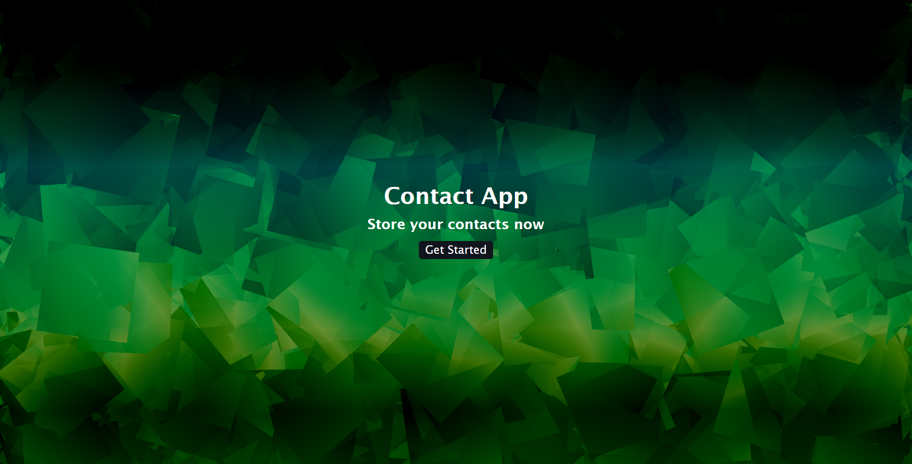
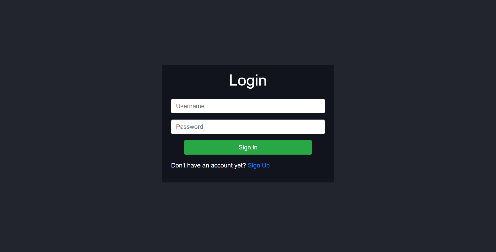
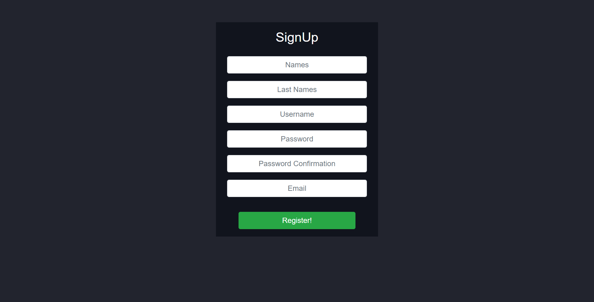
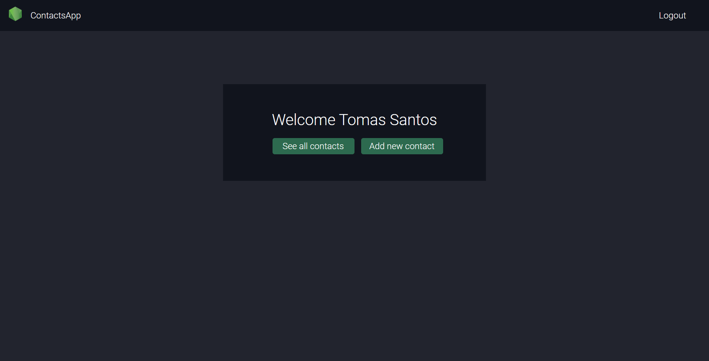
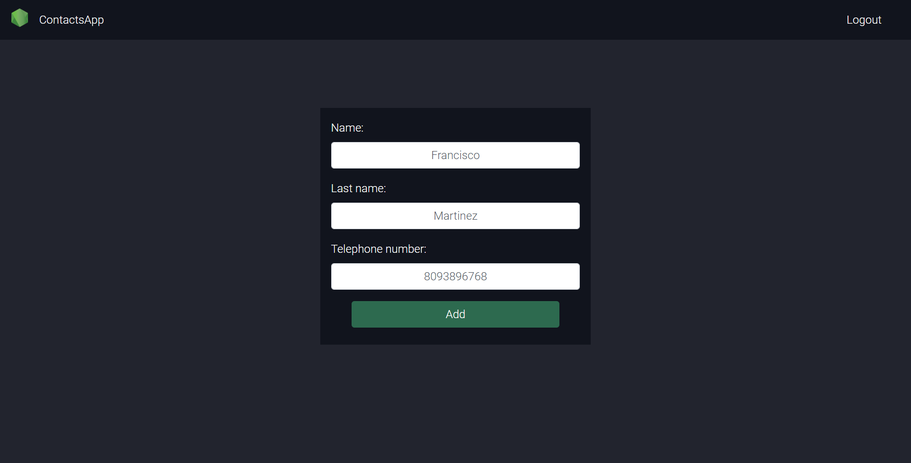
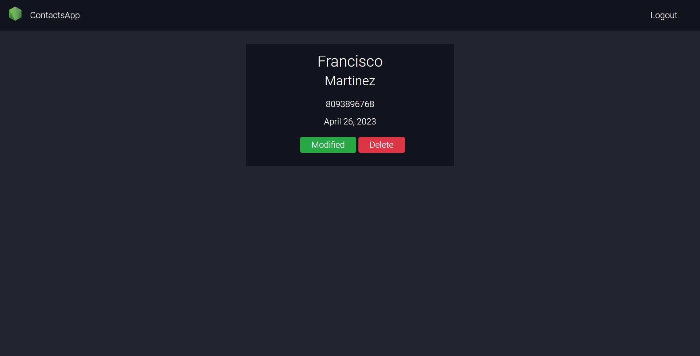
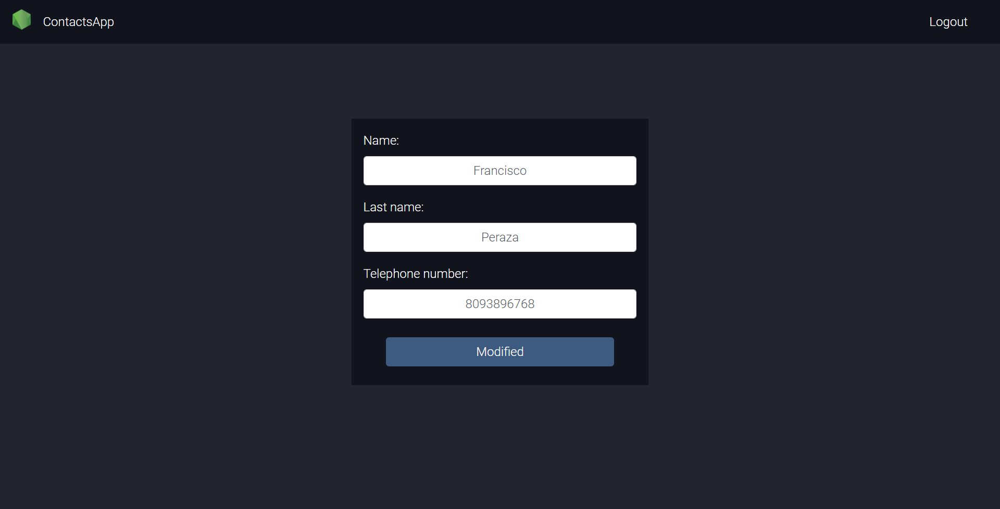
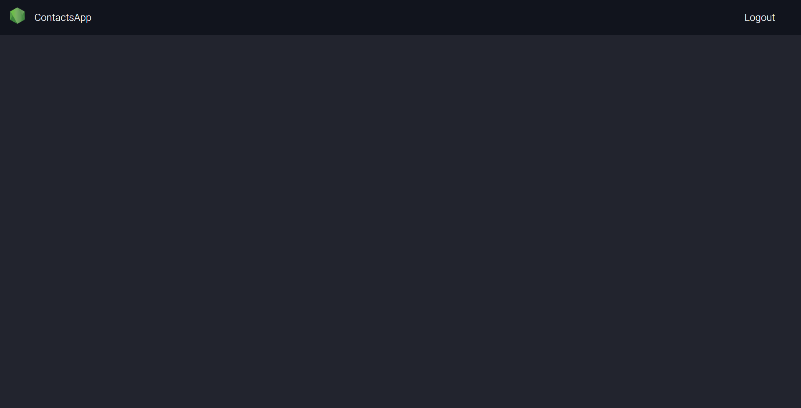

# ContactApp

The present project consists of a contacts application developed in Python with the Django web development framework. The application has a minimalist interface, but very friendly through which you can add, update or delete contacts.

### 1. Welcome

Welcome page to the application.

### 2. Login

Login page, where users can enter to the application.

### 3. Sign up

Here, users can create an account in the contact app.

### 4. Home

This is the home page where the user has the option to see all the contacts or add a new one.

### 5. Add contact

In this page a user can add a new contact to their contact list.

### 6. All contacts

In this page a user can see all the contacts stored in the applicacion.

### 7. Edit contact

In this page a user can see edit the information of one of their contacts.

### 8. Delete contact

If a user press the delete button on the all contacts page, the user is removed from the database and is not displayed in the user list.

